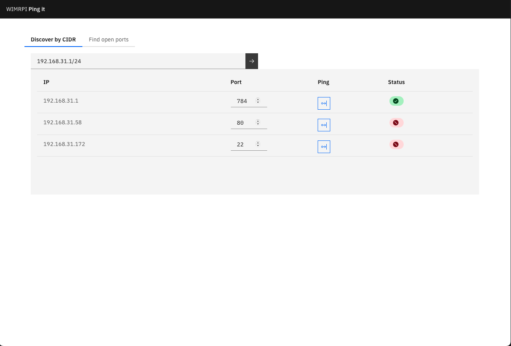

# wimrpi
Simple network discovery utility 

# Description
The idea behind this utility is simple.

I was lazy and inpatient to wait for nmap to finish scanning my network every time I switch office/home.

So I decided to write a simple utility that will ping all the IP's in my network and will return the ones that are up.
You can also ping specific ports to check if they are open or build open ports tree for a specific IP.

It is not intrusive, so it is not a replacement for nmap or other network discovery tools.
However, it is a simple way to ping all needed IP`s exactly when you DO NOT NEED something intrusive.

# Usage
### Discover by CIDR tab
This tab is used to find all the IP's in a specific network.
You can specify the network in CIDR format (e.g. `192.168.0.1/24`)
On the right side you can specify the ports you want to ping (once IP discovered).

### Find open ports tab
This tab is used to find all the open ports for a specific IP.
You can specify or copy IP from the previous tab. (auto copy TBD)
You can add more IPs so open ports tree will be updated.
